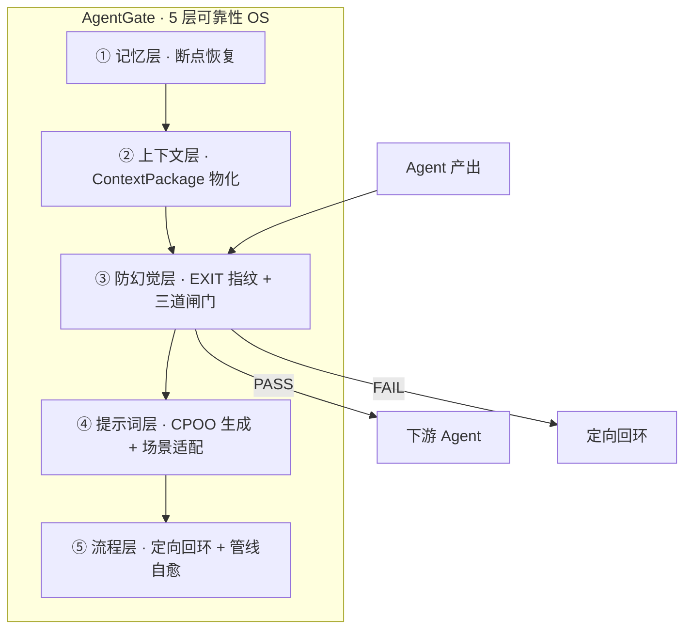
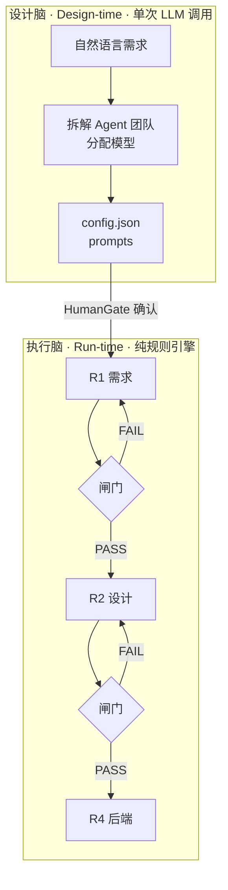
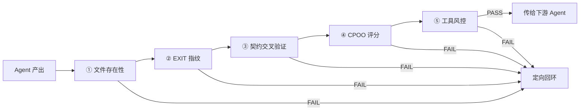

<div align="center">
  <h1>🛡️ AgentGate</h1>
  <p><strong>多 Agent 管线可靠性操作系统 — 「Agent 管编，闸门管信」</strong></p>
</div>

<div align="center">
  <a href="https://github.com/zw-onemaker-ai/agent_gate/blob/master/LICENSE"></a>
  <a href="#"></a>
  <a href="#"></a>
  <a href="#"></a>
</div>

<br>

## 这是什么

**市面上所有多 Agent 框架默认「Agent 产出可信」。AgentGate 默认「不可信，验证过才算」。**

当你让多个 AI Agent 协作完成一个项目时，怎么保证它们不互相传递垃圾？LangChain/CrewAI/AutoGen 关心的是「怎么串得更灵活」，AgentGate 关心的是「串起来的每一步可不可信」——每个 Agent 的输出必须通过闸门验证才能传给下一个，失败定向回环修复，管线卡死有医生自动诊断。

它出身于[一人公司·产品工厂](https://github.com/zw-onemaker-ai)的实战场景：一个人管理多 AI Agent 协作，没有人工审核的奢侈，必须靠系统自身保证输出质量。

---

## 五层可靠性 OS

AgentGate 不是在 Agent 外面加一层薄薄的校验——它是一套完整的 **5 层可靠性操作系统**，每层解决一类重复出现的多 Agent 协作问题：



| 层级 | 解决的痛点 | 没有这层会怎样 |
|------|-----------|--------------|
| ① 记忆 | Agent 调完失忆，下次从零开始 | 每次对话重建上下文，12 步管线走到第 8 步崩了→从头来 |
| ② 上下文 | Agent 间无共享大脑，传递失真 | 上游改了 API，下游不知道，调了三轮才发现接口对不上 |
| ③ 防幻觉 | 产出未经验证流入下游 | Agent 说「我写好了 main.py」→文件根本不存在→下游基于空气继续开发 |
| ④ 提示词 | 模型换了提示词不换 | 从 Claude 换到 Qwen，同一个提示词效果断崖下降 |
| ⑤ 流程 | 一个 Agent 卡住全线停摆 | Agent A 挂了→管线静默卡死→3 小时后你发现了 |

> **单层不够，5 层叠加才叫可靠性。** 就像刹车、安全带、气囊、ABS、碰撞预警——单用哪一个都不够，全配上才敢上路。

---

## 核心设计：双脑架构



设计脑用 LLM 做规划（需要创造力），执行脑用纯规则引擎做验证（需要可靠性）。这是刻意的不对称设计——**规划可以模糊，执行必须精确。** LLM 可能会胡说，但 `subprocess.run()` 不会。

---

## 跟其他框架的区别

AgentGate **是一个独立的多 Agent 可靠性框架**——跟 LangGraph/CrewAI 是**同级产品，不同方向**。别人做编排复杂度、协作、模型智能；AgentGate 编排做减法（串行+并行），可靠性做加法（验证+回环+自愈）。clone 即可使用，不依赖任何其他 Agent 框架。

| | LangChain | CrewAI | LangGraph | Dify | AutoGen | **AgentGate** |
|------|-----------|--------|-----------|------|---------|-----------|
| 定位 | LLM 应用开发 | 多 Agent 协作 | 状态机编排 | 可视化工作流 | 多 Agent 对话 | **Agent 管线可靠性** |
| 反幻觉 | 无内置 | 无内置 | 无内置 | 无内置 | 无内置 | EXIT 指纹+交叉验证 |
| 质量闸门 | 无 | 无 | 无 | 无 | 无 | 三道闸门，逐 Agent 验证 |
| 上下文管理 | 手动 | 手动 | State 持久化 | 变量节点 | 消息传递 | ContextPackage 物化+三级预算 |
| 管线诊断 | 无 | 无 | 无 | 无 | 无 | Pipeline Doctor 自动诊断 |
| 提示词优化 | 无 | 无 | 无 | 无 | 无 | CPOO 五模块自动生成 |
| 定向回环 | 无 | 无 | 条件分支 | 条件节点 | 无 | 按错误类型精确回环 |

> **简单说**：LangChain/CrewAI 把力气花在编排的灵活性。AgentGate 把力气花在调用的可靠性——单步调用无所谓，步数越多越值钱。别人都在造引擎，刹车赛道是空的。

---

## 谁该用 AgentGate

| 场景 | 痛点 | AgentGate 怎么帮 |
|------|------|-----------------|
| 🏢 **多 Agent 管线团队**<br>3+ Agent 协作，产出质量不稳定 | Agent 多了出错概率指数增长，一个人审不过来 | 每个 Agent 产出自动闸门验证，不用人盯 |
| 🏭 **内网/离线 AI 部署**<br>国企/安全单位，只能用本地模型 | Ollama+Qwen 等弱模型幻觉更严重，不敢上生产 | 5 层闸门兜底——弱模型也能达到生产级可靠性 |
| 💼 **AI 交付 freelancer**<br>一个人接项目，用 AI 加速交付 | AI 生成代码不知道能不能跑，调试时间比手写还长 | EXIT 指纹+契约验证——代码不跑通不放行 |

---

## 快速开始

### 安装

```bash
git clone https://github.com/zw-onemaker-ai/agent_gate.git
cd agent_gate

# 可选: 安装 LLM 依赖
pip install litellm  # 使用云端模型
# 或者什么都不装 → 自动用本地 Ollama
```

### 零配置试用（纯本地，不花一分钱）

```bash
# 1. 确保 Ollama 在运行
ollama pull qwen2.5:7b

# 2. 分析一个项目
python3 -c "
from src.platform_advisor import analyze_project
plan = analyze_project('做一个Markdown转PDF的CLI工具，支持中文')
print(plan.summary)
"

# 输出:
# 平台分配:
#   本地 Ollama | qwen2.5:7b → R1, R9 (轻量任务)
#   本地 Ollama | qwen2.5-coder:7b → R4 (代码生成)
# 需要API Key: 无
# 预估月成本: <$0.01/月
```

### 接入百炼（便宜且中文好）

```bash
export DASHSCOPE_API_KEY="sk-你的key"

python3 -c "from src.workspace import init_workspace; init_workspace()"
# 设计脑会自动: R1→qwen-turbo(便宜) R4→qwen-coder-plus(代码强)
```

### 三个可运行 Demo

```bash
# 不用模型，先看闸门和验证命令怎么自动生成（--mock 干跑）
python3 examples/demo_minimal.py --mock
python3 examples/demo_content.py --mock
python3 examples/demo_3role.py --mock

# 接真实 LLM（本地 Ollama，模型名换成你已 pull 的）
python3 examples/demo_minimal.py --provider ollama --model qwen2.5:7b
python3 examples/demo_3role.py --provider ollama --model qwen2.5:7b

# 76 个测试
python3 -m pytest
```

### 支持的所有平台

| 平台 | 适合场景 | 月成本参考 |
|------|---------|-----------|
| 本地 Ollama | 轻量任务、敏感数据、零成本 | 免费 |
| 阿里百炼 | 中文项目、性价比高 | ~$0.5 |
| DeepSeek | 代码生成、性价比极高 | ~$0.3 |
| OpenAI | 最复杂推理、英文项目 | ~$5 |
| Groq | 极速推理 | 有免费额度 |
| Anthropic | 长文本分析 | ~$3 |

---

## 整个管线怎么工作

### 1. 一句话建项目

```python
from src.platform_advisor import analyze_project, resolve_config
import json

plan = analyze_project("做一个会议室预定系统，FastAPI后端+React前端，支持Google日历同步")
config = resolve_config(plan)

with open("meeting_room.json", "w") as f:
    json.dump(config, f, indent=2, ensure_ascii=False)
```

生成的 `meeting_room.json` 已经包含了完整的 Agent 团队、每个 Agent 用的模型、验收标准、拓扑结构。

### 2. 跑管线

```python
from src.config_loader import build_pipeline

result = build_pipeline(config, provider="litellm", model="qwen-turbo")
gate = result["gate"]
gate.run_pipeline(initial_context="按照 meeting_room.json 中的规格开发")

# 诊断（如果出错）
diagnosis = gate.diagnose()
print(diagnosis.summary)

session_id = gate.save()  # 保存状态，下次可恢复
```

### 3. 怎么保证质量



任一步验证失败 → 定向回环：回退到出问题的那个 Agent（不是盲目重启整个管线）。

---

## 真实战痕：AI 管线踩过的坑

这些不是理论推演，是跑了 100+ 次多 Agent 管线后发现的反模式：

| 反模式 | 表现 | AgentGate 怎么防 |
|-----------|------|-----------------|
| **CSS 同名覆盖** | 两个 CSS 文件有同名选择器，后者静默覆盖前者。改了 3 轮才发现 | 契约验证检测到文件变更但效果不匹配时触发警告 |
| **数据库幽灵库** | 相对路径 `./data/db.sqlite` → 工作目录变化 → 连到空库 → 表「丢了」 | EXIT 指纹验证启动时检查数据库连接 |
| **Agent 说做了其实没做** | Agent 声称「已经写好了 main.py」→ 文件根本不存在 → 下游基于空气开发 | 文件存在性检查：每个产出文件必须真实存在且非空 |
| **重启删库** | 启动脚本里有 `rm -f *.db` → 用户数据全丢 | 工具白名单拦截高风险文件操作 |

---

## 项目结构

```
agent_gate/
├── src/
│   ├── engine.py              ← 执行引擎核心
│   ├── orchestrator_agent.py  ← 设计脑 (需求→配置)
│   ├── platform_advisor.py    ← 平台顾问 (自动选模型)
│   ├── validators.py          ← 质量验证器 (EXIT指纹/契约验证)
│   ├── human_gate.py          ← 人工干预 (不可分类错误升级)
│   ├── cpoo_scorer.py         ← 提示词评分
│   ├── tool_registry.py       ← 工具白名单+风险分级
│   ├── memory_manager.py      ← 状态持久化+防膨胀裁剪
│   ├── pipeline_doctor.py     ← 管线自动诊断
│   ├── context_assembler.py   ← 上下文预算+ContextPackage组装
│   ├── llm_client.py          ← 多模型统一调用
│   ├── config_loader.py       ← 配置验证
│   └── workspace.py           ← 工作区配置
├── docs/
│   ├── TECHNICAL_ARCHITECTURE.md  ← 完整技术架构
│   └── protocols/
│       ├── 01_exit_fingerprint.md    ← EXIT 指纹协议
│       ├── 02_quality_gate.md        ← 质量闸门判定逻辑
│       └── 03_oriented_loopback.md   ← 定向回环机制
├── configs/                   ← 配置模板
└── tests/test_core.py         ← 76 个测试
```

---

## 深入阅读

README 是店招，技术细节在文档里：

| 想了解 | 去看 |
|--------|------|
| 完整架构设计、双脑分离原理、5 层详细拆解 | [`docs/TECHNICAL_ARCHITECTURE.md`](docs/TECHNICAL_ARCHITECTURE.md) |
| EXIT_CODE 指纹为什么 Agent 伪造不了 | [`docs/protocols/01_exit_fingerprint.md`](docs/protocols/01_exit_fingerprint.md) |
| 质量闸门三道检查的完整判定逻辑 | [`docs/protocols/02_quality_gate.md`](docs/protocols/02_quality_gate.md) |
| 定向回环的 4 种路由路径和 HumanGate 触发条件 | [`docs/protocols/03_oriented_loopback.md`](docs/protocols/03_oriented_loopback.md) |

---

## 设计哲学

### 从一人公司长出来的

这个项目来自真实需求：一个人管多个 AI Agent，没有团队帮你审核输出。所以 AgentGate 把「不信任任何 Agent 的输出」作为默认姿态——每个 Agent 的输出都必须通过 Bash 验证，每次 Bash 验证都必须带 EXIT_CODE 指纹。**信任是假的，验证才是真的。**

### 约束手，不约束脑

限制 Agent 能做什么操作（工具白名单、风险分级），但不限制 Agent 怎么思考。Agent 有判断权（需要什么工具），框架有执行权（真正调用+验证）。闸门不是天花板，是地板——只管「不低于」，不管「有多高」。

### 设计脑 vs 执行脑

从编译器设计借鉴——前端负责理解和规划（可以模糊），后端负责生成和验证（必须精确）。设计脑用 LLM 做需求拆解，执行脑用纯 Python 做规则执行。LLM 可能会胡说，但 `subprocess.run()` 不会。

---

## 合作咨询

AgentGate 是开源项目（MIT），可自由使用。如果你需要：

- **企业多 Agent 管线架构咨询** — 帮你的团队设计可靠的 Agent 协作拓扑
- **内网/离线 AI 部署方案** — Ollama + Qwen + AgentGate，不依赖外网的生产级可靠性
- **定制化闸门规则** — 针对你的业务场景定制验证逻辑

欢迎通过 [GitHub Issues](https://github.com/zw-onemaker-ai/agent_gate/issues) 或 [Discussions](https://github.com/zw-onemaker-ai/agent_gate/discussions) 联系。

---

## 贡献

欢迎任何形式的贡献：

- **Bug 报告**: [Issues](https://github.com/zw-onemaker-ai/agent_gate/issues)
- **功能建议**: [Discussions](https://github.com/zw-onemaker-ai/agent_gate/discussions)
- **PR**: 确保 `python3 -m pytest tests/test_core.py` 全部通过

## 许可

MIT License © 2026 zw-onemaker-ai
